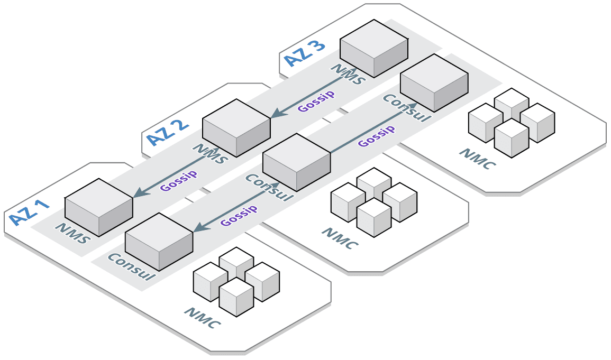
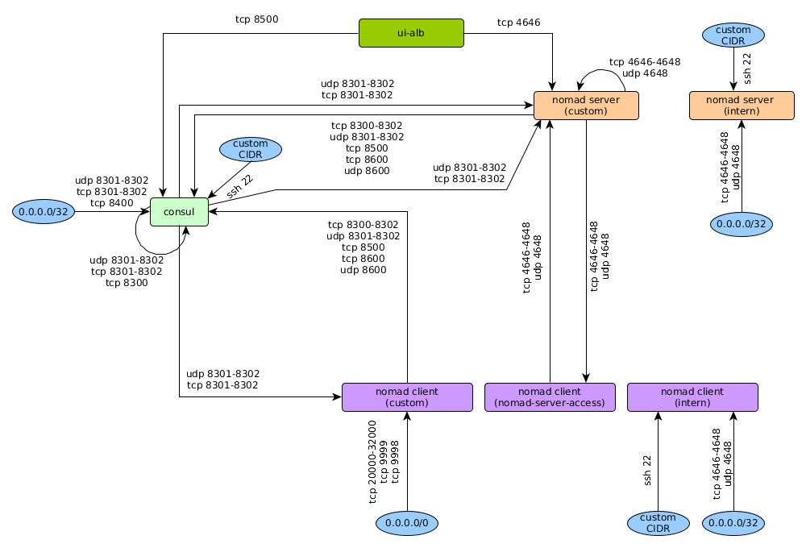

# Basic Cluster Orchestration System

Making use of terraform and nomad to setup a cluster orchestration system.
This respository will provide an extended example from the main [nomad terraform module](https://github.com/hashicorp/terraform-aws-nomad/tree/master/examples/nomad-consul-separate-cluster)

## Architecture

The COS (Cluster Orchestration System) consists of three core components.

1. A cluster of [nomad servers](modules/nomad) servers (NMS, the leaders).
2. Several [nomad clients](modules/nomad-datacenter) (NMC).
3. A cluster of [consul servers](modules/consul) used as service registry. Together with the consul-agents on each of the instances, consul is used as Service Discovery System.

*The nomad instances are organized in so called data-centers. A data-center is a group of nomad instances. A data-center can be specified as destination of a deployment of a nomad job.*

The COS organizes it's nodes in five different data-centers.

1. **DC leader**: Contains the nomad servers (NMS).
2. **DC backoffice**: Contains those nomad clients (NMC) that provide basice functionality in order to run services. For example the prometheus servers and Grafana runs there.
3. **DC public-services**: Contains public facing services. These are services the clients directly get in touch with. They process ingress traffic. Thus an ingress load-balancer like fabio runs on those nodes.
4. **DC private-services**: Contains services wich are used internally. Those services do the real work, but need no access from/ to the internet.
5. **DC content-connector**: Contains services which are used to obtain/ scrape data from external sources. They usually load data from content-providers.

The data-centers of the COS are organized/ live in three different subnets.

1. **Backoffice**: This is the most important one, since it contains the most important instances, like the nomad servers. Thus it's restricted the most and has no access to the internet (either ingress nor egress).
2. **Services**: This subnet contains the services that need no egress access to the internet. Ingress access is only granted for some of them over an ALB, but not directly.
3. **Content-Connector**: This subnet contains services that need egress access to the internet in order to obtain data from conent-providers.

### HA-Setup

The consul-servers as well as the nomad-servers are build up in an high-availability set up. At least three consul- and nomad-servers are deployed in different availability-zones. The nomad-clients are deployed in three different AZ's as well.

## Structure

### _docs

Providing detailed documentation for this module.

### examples

Provides example instanziation of this module.
The [root-example](examples/root-example) builds up a full working nomad-cluster including the underlying networking, the nomad servers and -clients and a consul cluster for service discovery.

### modules

Terraform modules for separate aspects of the cluster orchestration system.

* [nomad](modules/nomad): Module that creates a cluster of nomad masters.
* [nomad-datacenter](modules/nomad-datacenter): Module that creates a cluster of nomad clients for a specific data-center.
* [consul](modules/consul): Module building up a consul cluster.
* [ui-access](modules/ui-access): Module building up alb's to grant access to nomad-, consul- and fabio-ui.
* [ami](modules/ami): Module for creating an AMI having nomad, consul and docker installed (based on Amazon Linux AMI 2017.09.1 .
* [ami2](modules/ami2): Module for creating an AMI having nomad, consul and docker installed (based on AAmazon Linux 2 LTS Candidate AMI 2017.12.0).
* [networking](modules/networking): **This module is only used to support the examples**. It is not part of the main cos module.

#### Module Dependencies

The picture shows the dependencies within the modules of the cos-stack and the dependencies to the networking-stack.

## Security

### Security-Groups

## References

* [Nomad Terraform Module](https://github.com/hashicorp/terraform-aws-nomad)
* [Consul Terraform Module](https://github.com/hashicorp/terraform-aws-consul)
