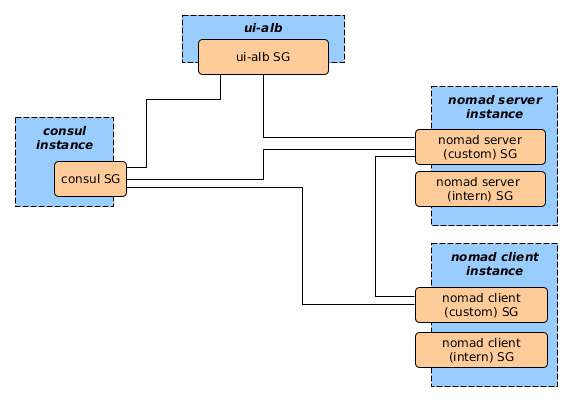
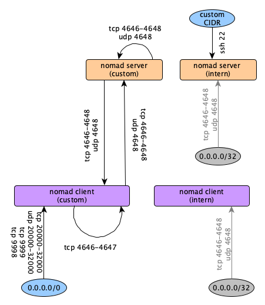
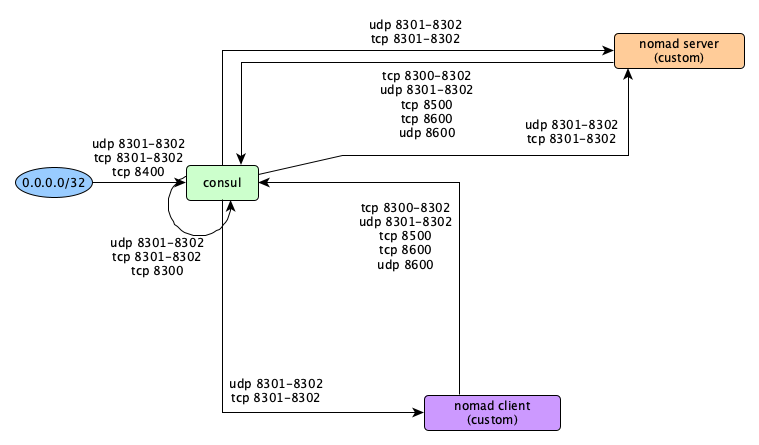
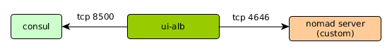

# Sgrules Module

In this module the security groups of nomdad-clients, -server and consul-nodes are connected apropriately to ensure that the minimal needed access between the instances is ensured.

## Overview

## Sgrules between Nomad Servers and Clients

## Sgrules between Consul and Nomad Instances

## Sgrules between UI-ALB and Nomad, Consul Instances

